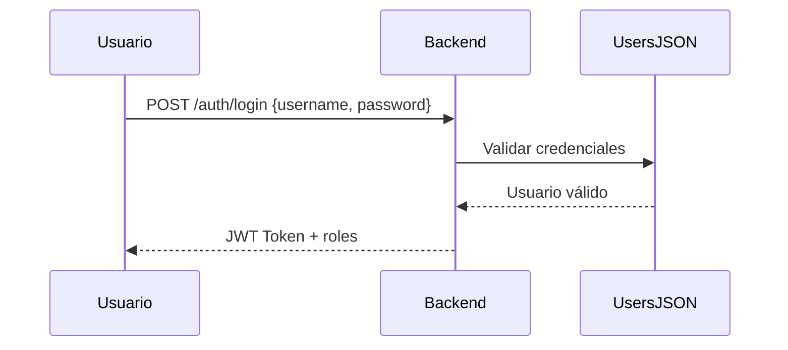
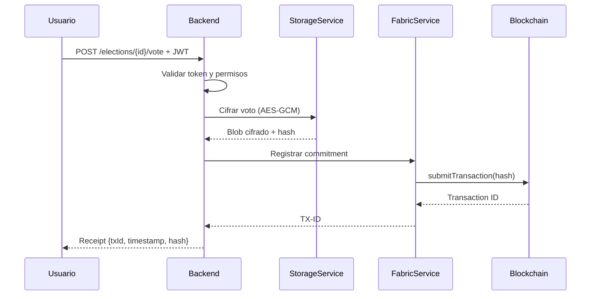
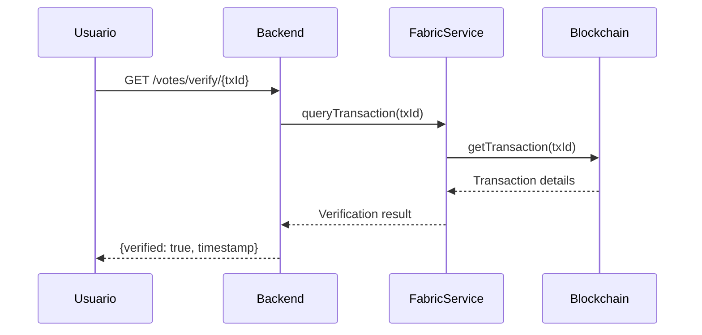
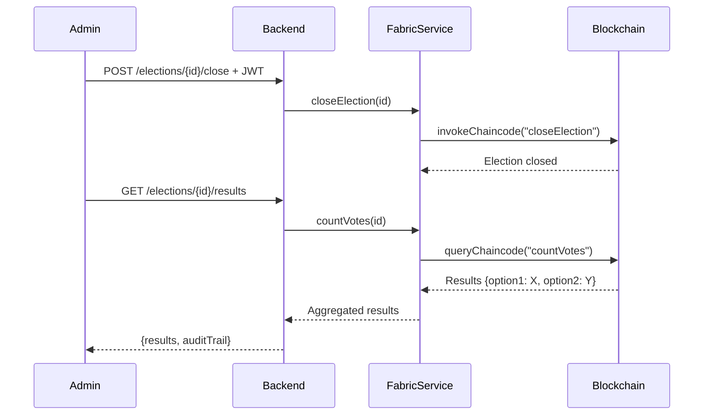

# Sistema de Votación Sindical basado en Blockchain

[](https://openjdk.org/projects/jdk/21/)
[](https://spring.io/projects/spring-boot)
[](https://www.hyperledger.org/use/fabric)
[](https://angular.io/)
[](LICENSE)

> **Trabajo Fin de Grado** - Enrique Huet Adrover  
> Sistema de votación electrónica segura para procesos sindicales utilizando tecnología blockchain

## 📋 Tabla de Contenidos

- [Descripción](#-descripción)
- [Características Principales](#-características-principales)
- [Arquitectura del Sistema](#-arquitectura-del-sistema)
- [Stack Tecnológico](#-stack-tecnológico)
- [Requisitos Previos](#-requisitos-previos)
- [Instalación](#-instalación)
- [Configuración](#-configuración)
- [Ejecución](#-ejecución)
- [Testing](#-testing)
- [Estructura del Proyecto](#-estructura-del-proyecto)
- [Flujo de Votación](#-flujo-de-votación)
- [Seguridad](#-seguridad)
- [API REST](#-api-rest)
- [Roadmap](#-roadmap)
- [Contribuciones](#-contribuciones)
- [Licencia](#-licencia)

## 🎯 Descripción

Sistema de votación electrónica diseñado específicamente para procesos sindicales que combina la **transparencia** y **auditabilidad** de blockchain con la **privacidad** del voto mediante cifrado AES-GCM. El proyecto utiliza **Hyperledger Fabric** como plataforma blockchain permisionada y **Spring Boot** como backend robusto y escalable.

### Objetivo

Proporcionar un sistema de votación que garantice:
- ✅ **Anonimato del voto**: Nadie puede vincular un voto con su emisor
- ✅ **Integridad**: Votos inmutables una vez registrados
- ✅ **Transparencia**: Proceso auditable por terceros
- ✅ **Disponibilidad**: Sistema descentralizado resistente a fallos
- ✅ **Verificabilidad**: Los votantes pueden verificar que su voto fue contabilizado

## ✨ Características Principales

### Funcionalidades Implementadas

- [x] **Autenticación Mock** - Sistema de autenticación simulado (preparado para Azure EntraID)
- [x] **Gestión de Elecciones** - Creación, configuración y administración de procesos electorales
- [x] **Emisión de Voto Cifrado** - Cifrado AES-GCM de votos antes de ser registrados
- [x] **Registro en Blockchain** - Commitment hash almacenado en Hyperledger Fabric
- [x] **Recibo de Voto** - Prueba criptográfica de participación sin revelar el voto
- [x] **Verificación de Voto** - Los votantes pueden verificar su participación
- [x] **API RESTful** - Endpoints documentados para integración con frontend
- [x] **Configuración Modular** - Sistema de configuración flexible y extensible
- [x] **Modo Mock para PoC** - Desarrollo y testing sin infraestructura blockchain

### Funcionalidades en Desarrollo

- [ ] **Frontend Angular** - Interfaz de usuario completa
- [ ] **Chaincode Hyperledger** - Smart contracts para lógica de votación
- [ ] **Auditoría Avanzada** - Panel de control para auditores
- [ ] **Notificaciones** - Sistema de alertas por email/SMS
- [ ] **Integración Azure EntraID** - Autenticación empresarial real

## 🏗️ Arquitectura del Sistema

```
┌────────────────────────────────────────────────────────────────┐
│                         FRONTEND                               │
│                    Angular 17 + Material                       │
└────────────────────────────┬───────────────────────────────────┘
                             │ HTTP/REST
                             │ JWT Authentication
┌────────────────────────────▼───────────────────────────────────┐
│                      BACKEND API                               │
│                  Spring Boot 3.5.7 + Java 21                   │
│                                                                │
│  ┌──────────────┐  ┌──────────────┐  ┌──────────────┐          │
│  │   Auth       │  │  Election    │  │  Vote        │          │
│  │ Controller   │  │  Controller  │  │  Controller  │          │
│  └──────┬───────┘  └──────┬───────┘  └──────┬───────┘          │
│         │                 │                  │                 │
│  ┌──────▼─────────────────▼──────────────────▼───────┐         │
│  │              Service Layer                        │         │
│  │  • AuthService   • StorageService                 │         │
│  │  • FabricService • ElectionService                │         │
│  └──────┬─────────────────┬──────────────────┬───────┘         │
└─────────┼─────────────────┼──────────────────┼─────────────────┘
          │                 │                  │
          │                 │                  │
┌─────────▼─────────┐ ┌────▼──────────┐ ┌────▼─────────────────┐
│  Mock Users       │ │  Encrypted    │ │  Hyperledger Fabric  │
│  JSON Database    │ │  Storage      │ │  Blockchain Network  │
│                   │ │  (AES-GCM)    │ │                      │
│  • users.json     │ │  • Vote blobs │ │  • Orderer Service   │
│  • JWT Tokens     │ │  • Keystore   │ │  • Peer Nodes (Orgs) │
└───────────────────┘ └───────────────┘ │  • Chaincode         │
                                        │  • Channel Ledger    │
                                        └──────────────────────┘
```

### Componentes Clave

#### Backend (Spring Boot)
- **Controladores REST**: Exponen API para frontend
- **Servicios de Negocio**: Lógica de votación, cifrado, blockchain
- **Configuración Modular**: Propiedades separadas por dominio
- **Seguridad**: JWT + Spring Security

#### Blockchain (Hyperledger Fabric)
- **Chaincode**: Smart contracts en Node.js para lógica de votación
- **Canal Privado**: Red permisionada con organizaciones definidas
- **Ordering Service**: Consenso y ordenación de transacciones
- **Peer Nodes**: Nodos validadores de las organizaciones

#### Almacenamiento
- **On-Chain**: Hashes y commitments (inmutables)
- **Off-Chain**: Votos cifrados con AES-GCM (privacidad)
- **Keystore**: Gestión segura de claves de cifrado

## 🛠️ Stack Tecnológico

### Backend
| Tecnología | Versión | Propósito |
|-----------|---------|-----------|
| **Java** | 21 LTS | Lenguaje principal + Virtual Threads |
| **Spring Boot** | 3.5.7 | Framework backend |
| **Spring Security** | 6.2.x | Autenticación y autorización |
| **Maven** | 3.9+ | Gestión de dependencias |
| **Jackson** | 2.x | Serialización JSON/YAML |

### Blockchain
| Tecnología | Versión | Propósito |
|-----------|---------|-----------|
| **Hyperledger Fabric** | 2.5 | Plataforma blockchain |
| **Fabric Gateway SDK** | 1.4.0 | Cliente Java para Fabric |
| **Node.js** | 18+ | Runtime para chaincode |
| **Docker** | 20+ | Contenedores para red Fabric |

### Seguridad y Cifrado
| Tecnología | Versión | Propósito |
|-----------|---------|-----------|
| **JJWT** | 0.12.3 | Tokens JWT |
| **BouncyCastle** | 1.78.1 | Criptografía AES-GCM |
| **AES-GCM** | 256-bit | Cifrado de votos |

### Frontend
| Tecnología | Versión | Propósito |
|-----------|---------|-----------|
| **Angular** | 17 | Framework SPA |
| **TypeScript** | 5+ | Lenguaje tipado |
| **Angular Material** | 17 | Componentes UI |
| **RxJS** | 7+ | Programación reactiva |

### Testing
| Tecnología | Versión | Propósito |
|-----------|---------|-----------|
| **JUnit 5** | 5.10+ | Testing unitario |
| **Mockito** | 5.x | Mocking |
| **Spring Boot Test** | 3.5.7 | Testing de integración |

## 📦 Requisitos Previos

### Software Necesario

```bash
# Java Development Kit 21
java --version  # Debe ser 21+

# Maven
mvn --version   # Debe ser 3.9+

# Docker & Docker Compose (para Hyperledger Fabric)
docker --version         # 20.10+
docker-compose --version # 2.0+

# Node.js (para chaincode)
node --version  # 18+
npm --version   # 9+

# Git
git --version
```

### Opcional (Frontend)
```bash
# Angular CLI
npm install -g @angular/cli@17
ng version
```

## 🚀 Instalación

### 1. Clonar el Repositorio

```bash
git clone https://github.com/tu-usuario/votacion-blockchain.git
cd votacion-blockchain
```

### 2. Configurar Backend

```bash
cd backend-spring

# Compilar el proyecto
./mvnw clean install

# Verificar que compila correctamente
./mvnw test
```

**Salida esperada:**
```
[INFO] Tests run: 14, Failures: 0, Errors: 0, Skipped: 0
[INFO] BUILD SUCCESS
```

### 3. Configurar Hyperledger Fabric

```bash
# Instalar binarios y docker images de Fabric (esto creará la carpeta 'fabric')
chmod +x install-fabric.sh
./install-fabric.sh

# Iniciar red de prueba
cd scripts
./start-network.sh
```

El script `start-network.sh` se encargará de:
1. Iniciar la red con CouchDB
2. Crear el canal `electionchannel`
3. Desplegar el chaincode Java `electioncc`

### 4. Configurar Frontend (Opcional)

```bash
cd frontend-angular

# Instalar dependencias
npm install

# Verificar que funciona
ng serve
```

## ⚙️ Configuración

### Archivo de Configuración Principal

Editar `backend-spring/src/main/resources/application.yaml`:

```yaml
# Configuración de Hyperledger Fabric
fabric:
  connection-profile: "/ruta/a/connection-org1.json"
  wallet-path: "/ruta/a/wallet"
  user: "appUser"
  channel: "electionchannel"
  chaincode: "electioncc"

# Configuración de almacenamiento cifrado
storage:
  base-path: "/ruta/a/storage"
  keystore-path: "/ruta/a/keystore.json"
  encryption:
    algorithm: "AES/GCM/NoPadding"
    key-length: 256

# Configuración de autenticación
auth:
  users-file: "/ruta/a/users.json"
  jwt:
    secret: "tu-secret-seguro-aqui"
    expiration: 3600
```

### Crear Archivos de Configuración

#### 1. Keystore para cifrado (keystore.json)
```json
{
  "masterKey": "base64-encoded-aes-256-key",
  "createdAt": "2025-11-10T00:00:00Z",
  "algorithm": "AES/GCM/NoPadding",
  "keyLength": 256
}
```

#### 2. Usuarios mock (users.json)
```json
[
  {
    "id": "user1",
    "username": "juan.perez",
    "email": "juan.perez@empresa.com",
    "roles": ["voter"],
    "department": "Producción",
    "active": true
  },
  {
    "id": "admin1",
    "username": "admin",
    "email": "admin@empresa.com",
    "roles": ["admin", "auditor"],
    "department": "RRHH",
    "active": true
  }
]
```

### Variables de Entorno (Opcional)

```bash
# Crear .env en la raíz
export FABRIC_CONNECTION_PROFILE=/ruta/a/connection.json
export FABRIC_WALLET_PATH=/ruta/a/wallet
export JWT_SECRET=secret-seguro
export STORAGE_BASE_PATH=/ruta/a/storage
```

## 🎮 Ejecución

### Modo Desarrollo (con Mock)

```bash
cd backend-spring

# Ejecutar con perfil de desarrollo
./mvnw spring-boot:run

# O usar el JAR compilado
./mvnw clean package
java -jar target/votacion-0.0.1-SNAPSHOT.jar
```

La aplicación estará disponible en: **http://localhost:8080/api/v1**

### Endpoints Disponibles

- **Health Check**: `GET /actuator/health`
- **API Documentation**: `GET /actuator/info`
- **Metrics**: `GET /actuator/metrics`

### Logs

Los logs se guardan en:
```
backend-spring/logs/application.log
```

Ver logs en tiempo real:
```bash
tail -f backend-spring/logs/application.log
```

## 🧪 Testing

### Ejecutar Todos los Tests

```bash
cd backend-spring
./mvnw test
```

### Ejecutar Tests Específicos

```bash
# Tests de configuración
./mvnw test -Dtest=ConfigurationPropertiesTest

# Tests de FabricService
./mvnw test -Dtest=FabricServiceTest

# Tests con cobertura
./mvnw test jacoco:report
```

### Cobertura de Tests

Los reportes de cobertura se generan en:
```
backend-spring/target/site/jacoco/index.html
```

### Tests Actuales

| Clase de Test | Tests | Estado |
|--------------|-------|--------|
| `ConfigurationPropertiesTest` | 4 | ✅ Passing |
| `FabricServiceTest` | 9 | ✅ Passing |
| `ApplicationTests` | 1 | ✅ Passing |
| **TOTAL** | **14** | **✅ 100%** |

## 📁 Estructura del Proyecto

```
VotacionBC/
├── backend-spring/              # Backend Spring Boot
│   ├── src/
│   │   ├── main/
│   │   │   ├── java/es/tfg/votacion/
│   │   │   │   ├── Application.java              # Punto de entrada
│   │   │   │   ├── config/                       # Configuración
│   │   │   │   │   ├── AppProperties.java        # ✅ Coordinador
│   │   │   │   │   ├── FabricProperties.java     # ✅ Config Fabric
│   │   │   │   │   ├── StorageProperties.java    # ✅ Config Storage
│   │   │   │   │   ├── AuthProperties.java       # ✅ Config Auth
│   │   │   │   │   ├── ElectionProperties.java   # ✅ Config Elections
│   │   │   │   │   └── SecurityConfig.java       # 🚧 En desarrollo
│   │   │   │   ├── controller/                   # 🚧 Controladores REST
│   │   │   │   │   ├── AuthController.java
│   │   │   │   │   └── ElectionController.java
│   │   │   │   ├── service/                      # 🚧 Servicios de negocio
│   │   │   │   │   ├── FabricService.java        # ✅ Implementado
│   │   │   │   │   ├── StorageService.java       # 🚧 En desarrollo
│   │   │   │   │   └── AuthService.java          # 🚧 En desarrollo
│   │   │   │   └── model/                        # ✅ Modelos de datos
│   │   │   │       ├── User.java
│   │   │   │       ├── UserRole.java
│   │   │   │       ├── Election.java
│   │   │   │       ├── ElectionOption.java
│   │   │   │       ├── ElectionStatus.java
│   │   │   │       ├── VoteRequest.java
│   │   │   │       └── Receipt.java
│   │   │   └── resources/
│   │   │       ├── application.yaml              # ✅ Configuración principal
│   │   │       ├── keystore/                     # 🚧 Claves de cifrado
│   │   │       └── mock/                         # 🚧 Datos mock
│   │   └── test/                                 # ✅ Tests
│   │       └── java/es/tfg/votacion/
│   │           ├── config/
│   │           │   └── ConfigurationPropertiesTest.java
│   │           ├── service/
│   │           │   └── FabricServiceTest.java
│   │           └── ApplicationTests.java
│   ├── data/storage/                             # Almacenamiento cifrado
│   ├── wallet/                                   # Identidades Fabric
│   ├── logs/                                     # Logs de aplicación
│   ├── pom.xml                                   # Dependencias Maven
│   └── PLAN_TRABAJO.md                           # 🚧 Plan detallado
│
├── frontend-angular/                             # 🚧 Frontend Angular (vacío)
│   └── (estructura pendiente)
│
├── chaincode/                                    # 🚧 Smart contracts (vacío)
│   └── (estructura pendiente)
│
├── fabric/                               # Red Hyperledger Fabric (anteriormente fabric-samples)
│   └── test-network/                             # Red de prueba
│
├── scripts/                                      # Scripts de utilidad
│   ├── setup-fabric.sh
│   ├── deploy-chaincode.sh
│   └── generate-keystore.sh
│
├── docs/                                         # Documentación adicional
│   ├── architecture.md
│   ├── api-reference.md
│   └── security-considerations.md
│
├── PLAN_TRABAJO.md                               # ✅ Plan de trabajo detallado
└── README.md                                     # ✅ Este archivo
```

### Estado de Implementación

| Componente | Estado | Completado |
|-----------|--------|------------|
| **Modelos de Datos** | ✅ Completo | 100% |
| **Configuración** | ✅ Completo | 100% |
| **FabricService** | ✅ Completo | 100% |
| **StorageService** | 🚧 En desarrollo | 30% |
| **AuthService** | 🚧 En desarrollo | 20% |
| **Controladores** | 🚧 En desarrollo | 10% |
| **SecurityConfig** | 🚧 En desarrollo | 40% |
| **Chaincode** | ⏳ Pendiente | 0% |
| **Frontend** | ⏳ Pendiente | 0% |

## 🔐 Flujo de Votación

### 1. Autenticación


### 2. Emisión de Voto


### 3. Verificación de Voto


### 4. Cierre y Recuento


## 🔒 Seguridad

### Capas de Seguridad Implementadas

#### 1. Autenticación y Autorización
- **JWT Tokens**: Autenticación stateless con expiración
- **Roles basados en RBAC**: voter, admin, auditor
- **Spring Security**: Protección de endpoints

#### 2. Cifrado de Datos
- **AES-GCM 256-bit**: Cifrado autenticado de votos
- **IV aleatorio**: Vector de inicialización único por voto
- **Tag de autenticación**: Integridad y autenticidad de datos

#### 3. Blockchain (Hyperledger Fabric)
- **Red permisionada**: Solo miembros autorizados
- **MSP (Membership Service Provider)**: Identidades criptográficas
- **Canal privado**: Aislamiento de datos
- **Endorsement policy**: Consenso multi-firma

#### 4. Comunicaciones
- **HTTPS**: TLS 1.3 en producción
- **CORS**: Configurado para dominios específicos
- **Rate Limiting**: Protección contra DoS

### Buenas Prácticas

✅ **No almacenar secretos en código**  
✅ **Rotación periódica de claves**  
✅ **Logs sin información sensible**  
✅ **Validación de entrada exhaustiva**  
✅ **Principio de mínimo privilegio**  

### Consideraciones de Privacidad

- ❌ **NO se almacena relación voto-votante**
- ✅ **Votos cifrados off-chain**
- ✅ **Solo hashes en blockchain**
- ✅ **Anonimización de datos de auditoría**

## 📡 API REST

### Endpoints de Autenticación

#### POST /api/v1/auth/login
Autenticación de usuario y obtención de token JWT.

**Request:**
```json
{
  "username": "juan.perez",
  "password": "secret123"
}
```

**Response:**
```json
{
  "token": "eyJhbGciOiJIUzI1NiIsInR5cCI6IkpXVCJ9...",
  "expiresIn": 3600,
  "user": {
    "id": "user1",
    "username": "juan.perez",
    "roles": ["voter"]
  }
}
```

#### GET /api/v1/auth/validate
Validación de token JWT.

**Headers:**
```
Authorization: Bearer <token>
```

**Response:**
```json
{
  "valid": true,
  "user": {
    "id": "user1",
    "username": "juan.perez",
    "roles": ["voter"]
  }
}
```

### Endpoints de Elecciones

#### GET /api/v1/elections
Listar elecciones disponibles.

**Response:**
```json
[
  {
    "id": "election-001",
    "title": "Delegado Sindical 2025",
    "description": "Elección de delegado sindical",
    "status": "ACTIVE",
    "startDate": "2025-11-10T00:00:00Z",
    "endDate": "2025-11-11T00:00:00Z",
    "options": [
      {"id": "opt1", "label": "Candidato A"},
      {"id": "opt2", "label": "Candidato B"}
    ]
  }
]
```

#### POST /api/v1/elections/{id}/vote
Emitir voto en una elección.

**Headers:**
```
Authorization: Bearer <token>
Content-Type: application/json
```

**Request:**
```json
{
  "electionId": "election-001",
  "optionId": "opt1",
  "commitment": "sha256-hash-of-encrypted-vote"
}
```

**Response:**
```json
{
  "transactionId": "TX-election-001-1699564800123",
  "timestamp": "2025-11-10T12:00:00Z",
  "electionId": "election-001",
  "verified": true
}
```

#### GET /api/v1/elections/{id}/results
Obtener resultados de una elección cerrada.

**Headers:**
```
Authorization: Bearer <token>
```

**Response:**
```json
{
  "electionId": "election-001",
  "status": "CLOSED",
  "totalVotes": 150,
  "results": [
    {"optionId": "opt1", "label": "Candidato A", "votes": 85},
    {"optionId": "opt2", "label": "Candidato B", "votes": 65}
  ],
  "auditTrail": "https://explorer.fabric/tx/..."
}
```

### Endpoints de Verificación

#### GET /api/v1/votes/verify/{transactionId}
Verificar que un voto fue registrado correctamente.

**Response:**
```json
{
  "transactionId": "TX-election-001-1699564800123",
  "verified": true,
  "blockNumber": 12345,
  "timestamp": "2025-11-10T12:00:00Z",
  "electionId": "election-001"
}
```

### Códigos de Estado

| Código | Significado |
|--------|------------|
| 200 | OK - Solicitud exitosa |
| 201 | Created - Recurso creado |
| 400 | Bad Request - Datos inválidos |
| 401 | Unauthorized - Autenticación requerida |
| 403 | Forbidden - Sin permisos |
| 404 | Not Found - Recurso no encontrado |
| 409 | Conflict - Ya votó en esta elección |
| 500 | Internal Server Error - Error del servidor |

## 🗺️ Roadmap

### Fase 1: Fundaciones ✅ (Completada)
- [x] Configuración del proyecto
- [x] Modelos de datos
- [x] Configuración modular
- [x] FabricService con mock
- [x] Tests iniciales

### Fase 2: Servicios Core 🚧 (En Progreso)
- [x] FabricService completo
- [ ] StorageService con AES-GCM
- [ ] AuthService mock
- [ ] Tests de servicios

### Fase 3: API REST 🚧 (En Progreso)
- [ ] AuthController
- [ ] ElectionController
- [ ] VoteController
- [ ] Exception handlers
- [ ] Documentación Swagger/OpenAPI

### Fase 4: Seguridad ⏳ (Pendiente)
- [ ] JWT filters
- [ ] Role-based access control
- [ ] Rate limiting
- [ ] Audit logging

### Fase 5: Blockchain ⏳ (Pendiente)
- [ ] Chaincode desarrollo
- [ ] Deployment en Fabric
- [ ] Pruebas de integración
- [ ] Performance testing

### Fase 6: Frontend ⏳ (Pendiente)
- [ ] Componentes Angular
- [ ] Autenticación UI
- [ ] Flujo de votación
- [ ] Panel de resultados
- [ ] Dashboard de administración

### Fase 7: Testing y QA ⏳ (Pendiente)
- [ ] Tests end-to-end
- [ ] Tests de carga
- [ ] Security testing
- [ ] Cobertura >80%

### Fase 8: Producción ⏳ (Pendiente)
- [ ] Configuración de producción
- [ ] CI/CD pipeline
- [ ] Monitoreo y alertas
- [ ] Documentación de despliegue
- [ ] Integración Azure EntraID

## 🤝 Contribuciones

Este es un proyecto académico (TFG), pero las sugerencias y feedback son bienvenidos.

### Proceso de Contribución

1. Fork el repositorio
2. Crear rama feature (`git checkout -b feature/AmazingFeature`)
3. Commit cambios (`git commit -m 'Add some AmazingFeature'`)
4. Push a la rama (`git push origin feature/AmazingFeature`)
5. Abrir Pull Request

### Código de Conducta

- Respetar las convenciones de código Java y Spring Boot
- Escribir tests para nuevo código
- Documentar cambios significativos
- Mantener cobertura de tests >80%

## 📄 Licencia

Este proyecto es un Trabajo Fin de Grado (TFG) desarrollado por Enrique Huet Adrover.

**Uso Académico**: El código está disponible para fines educativos y de investigación.

## 📞 Contacto

**Autor**: Enrique Huet Adrover  
**Universidad**: UOC -  Universitat Oberta de Catalunya  
**Email**: ehuet@uoc.edu


---

## 🙏 Agradecimientos

- **Hyperledger Foundation** - Por Fabric y su documentación
- **Spring Team** - Por Spring Boot y Spring Security
- **Comunidad Open Source** - Por las múltiples librerías utilizadas
- **Director de TFG** - Por la guía y supervisión

---

## 📚 Referencias

### Documentación Oficial
- [Hyperledger Fabric Documentation](https://hyperledger-fabric.readthedocs.io/)
- [Spring Boot Reference](https://docs.spring.io/spring-boot/docs/current/reference/html/)
- [Angular Documentation](https://angular.io/docs)

### Papers y Artículos
- Blockchain-based E-voting Systems: A Survey (2020)
- Privacy-Preserving Electronic Voting using Blockchain
- Hyperledger Fabric: A Distributed Operating System for Permissioned Blockchains

### Recursos de Aprendizaje
- [Fabric Samples Repository](https://github.com/hyperledger/fabric-samples)
- [Spring Boot Guides](https://spring.io/guides)
- [Baeldung - Spring Security](https://www.baeldung.com/security-spring)

---

<div align="center">

**⭐ Si este proyecto te resulta útil, considera darle una estrella en GitHub ⭐**

Hecho con ❤️ y ☕ por Enrique Huet Adrover

</div>
