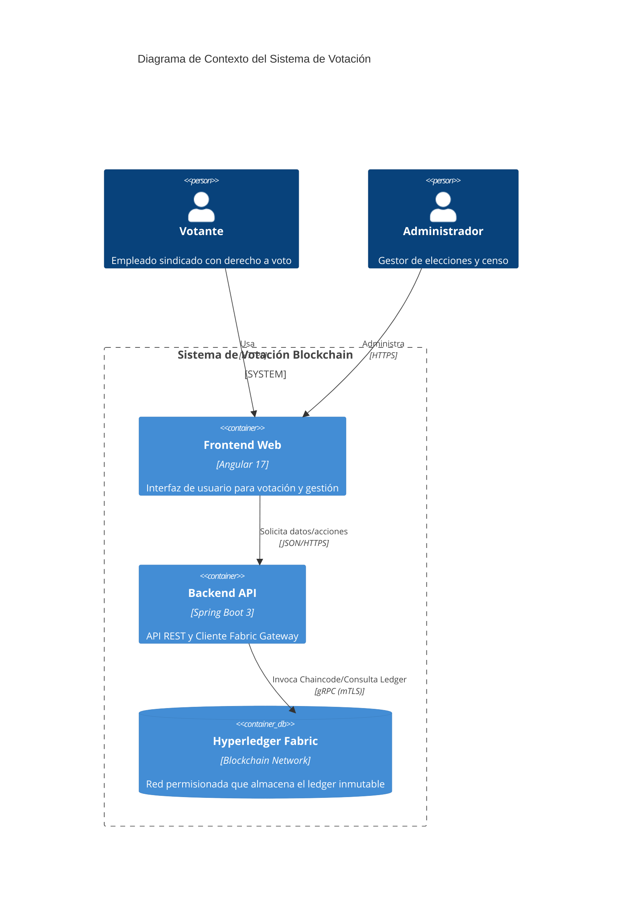
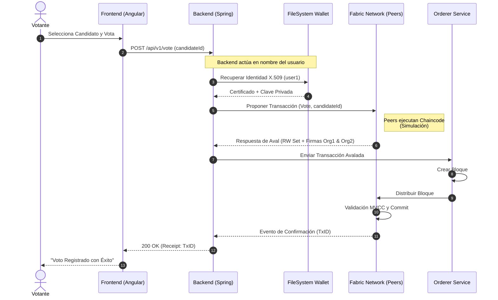

# Diseño de Arquitectura y Red Blockchain

Este documento detalla la arquitectura de alto nivel del sistema de votación, la topología de la red Hyperledger Fabric y el flujo de datos.

## 1. Visión Global (C4 Model)

El sistema sigue una arquitectura de tres capas clásica adaptada para aplicaciones descentralizadas (DApp).



### Componentes Principales
1.  **Frontend (Angular)**: SPA (Single Page Application) que gestiona la interacción del usuario. No almacena claves privadas; delega la firma de transacciones al Backend (modelo Custodial Wallet para simplificar UX).
2.  **Backend (Spring Boot)**: Actúa como cliente de la red Fabric. Gestiona las identidades de los usuarios (mapeadas a identidades Fabric en el Wallet) y expone endpoints REST.
3.  **Hyperledger Fabric**: La red blockchain subyacente que garantiza la inmutabilidad, trazabilidad y consenso de los votos.

## 2. Topología de Hyperledger Fabric

La red se basa en la configuración estándar `test-network` pero personalizada para el caso de uso de elecciones sindicales.

### Configuración de la Red
*   **Canal**: `electionchannel`
*   **Consenso**: Raft (EtcdRaft)
*   **Base de Datos de Estado**: CouchDB (para permitir consultas ricas JSON sobre los votos).

### Organizaciones y Nodos

```mermaid
graph TD
    subgraph "Orderer Organization"
        O1[Orderer Node<br/>(Raft)]
    end

    subgraph "Org1 (Sindicato A)"
        P1[Peer0 Org1<br/>(Endorser/Committer)]
        DB1[(CouchDB Org1)]
        CA1[CA Org1]
        GW1[Gateway Org1]
        
        P1 --- DB1
        P1 --- CA1
    end

    subgraph "Org2 (Sindicato B)"
        P2[Peer0 Org2<br/>(Endorser/Committer)]
        DB2[(CouchDB Org2)]
        CA2[CA Org2]
        
        P2 --- DB2
        P2 --- CA2
    end

    Backend[Backend Spring Boot] --> GW1
    GW1 -.-> P1
    GW1 -.-> P2
    GW1 -.-> O1
```

*   **Org1 (Sindicato A)**: Aloja el Backend y sirve como punto de entrada principal.
*   **Org2 (Sindicato B)**: Participa en el consenso y validación. Su firma es requerida para validar cualquier voto (según la política de aval).
*   **Orderer**: Ordena las transacciones en bloques y los distribuye a los peers.

## 3. Flujo de Transacción

El siguiente diagrama de secuencia ilustra el proceso completo de emisión de un voto, desde la UI hasta la confirmación en el bloque.



### Detalles Técnicos del Flujo
1.  **Autenticación**: El usuario se autentica en el Backend. El Backend mapea su usuario a una identidad almacenada en el `wallet/` local.
2.  **Propuesta**: El SDK de Java envía la propuesta de transacción a `peer0.org1` y `peer0.org2`.
3.  **Aval (Endorsement)**: Ambos peers ejecutan el chaincode. Si la lógica es correcta (fecha válida, usuario no ha votado), firman el resultado y lo devuelven.
4.  **Envío**: El Backend recoge las firmas y envía la transacción al Orderer.
5.  **Commit**: Una vez el bloque es validado por los peers, el estado del mundo (World State) en CouchDB se actualiza con el nuevo voto.

