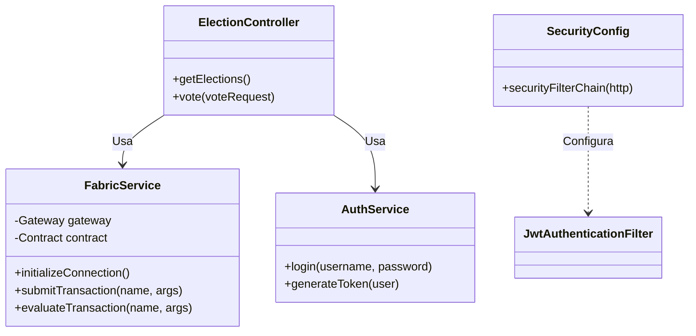

# Diseño del Backend (Spring Boot)

Este documento explica la arquitectura del servidor de aplicaciones, la gestión de identidades y la integración con el SDK de Fabric.

## 1. Arquitectura en Capas

El Backend sigue el patrón de diseño MVC (Model-View-Controller), aunque en este caso actúa como una API REST (sin vistas HTML renderizadas en servidor).

```mermaid
graph TD
    Client[Cliente HTTP (Angular)] --> Controller
    
    subgraph "Spring Boot Application"
        Controller[Controllers Layer<br/>(REST Endpoints)]
        Service[Service Layer<br/>(Business Logic)]
        Security[Security Layer<br/>(JWT Filter)]
        Gateway[Fabric Gateway Layer<br/>(Blockchain Client)]
        
        Controller --> Service
        Service --> Gateway
        Security -.-> Controller
    end
    
    Gateway --> Fabric[Hyperledger Fabric Network]
```

### Componentes Clave
*   **`ElectionController`**: Expone endpoints para listar elecciones y votar.
*   **`AuthController`**: Gestiona el login y la emisión de tokens JWT.
*   **`FabricService`**: Encapsula toda la complejidad de la comunicación con la blockchain.
*   **`SecurityConfig`**: Configura el filtro de seguridad para validar JWT en cada petición.

## 2. Diagrama de Clases (UML)



## 3. Seguridad y Autenticación (JWT)

El sistema utiliza **JSON Web Tokens (JWT)** para mantener la sesión del usuario de forma *stateless*.

### Flujo de Autenticación
1.  Usuario envía credenciales (`username`, `password`) a `/auth/login`.
2.  `AuthService` valida las credenciales (contra una base de datos en memoria o LDAP simulado).
3.  Si es válido, genera un JWT firmado con una clave secreta.
4.  El cliente incluye este JWT en el header `Authorization: Bearer <token>` en subsiguientes peticiones.

### Configuración de Spring Security
```java
// Extracto de SecurityConfig.java
@Bean
public SecurityFilterChain securityFilterChain(HttpSecurity http) throws Exception {
    http
        .csrf(AbstractHttpConfigurer::disable)
        .sessionManagement(session -> session.sessionCreationPolicy(SessionCreationPolicy.STATELESS))
        .authorizeHttpRequests(auth -> auth
            .requestMatchers("/auth/login").permitAll() // Público
            .requestMatchers("/api/v1/admin/**").hasRole("ADMIN") // Solo Admin
            .anyRequest().authenticated() // Resto requiere login
        )
        .addFilterBefore(jwtAuthenticationFilter, UsernamePasswordAuthenticationFilter.class);
    
    return http.build();
}
```

## 4. Integración con Hyperledger Fabric (Gateway)

La clase `FabricService` utiliza el **Fabric Gateway SDK for Java** para conectarse a la red.

### Conexión gRPC
La conexión se establece utilizando credenciales mTLS (Mutual TLS). El Backend actúa como un cliente autenticado de la **Org1**.

```java
// Extracto de FabricService.java
private void initGateway() throws Exception {
    // Cargar identidad X.509 (Certificado + Clave Privada)
    var identity = Identities.newX509Identity("Org1MSP", certificate);
    var signer = Signers.newPrivateKeySigner(privateKey);

    // Crear conexión gRPC con el Peer
    var builder = Gateway.newInstance()
            .identity(identity)
            .signer(signer)
            .connection(grpcChannel)
            .evaluateOptions(options -> options.withDeadline(5, TimeUnit.SECONDS))
            .endorseOptions(options -> options.withDeadline(15, TimeUnit.SECONDS))
            .submitOptions(options -> options.withDeadline(5, TimeUnit.SECONDS))
            .commitStatusOptions(options -> options.withDeadline(1, TimeUnit.MINUTES));

    this.gateway = builder.connect();
}
```

### Invocación de Transacciones
El servicio abstrae la complejidad de `submit` (escribir) vs `evaluate` (leer).

*   **`submitTransaction`**: Envía la propuesta a los peers, recoge los avales y la envía al Orderer. Espera el evento de commit.
*   **`evaluateTransaction`**: Solo consulta el estado en el peer local (no genera bloque).

