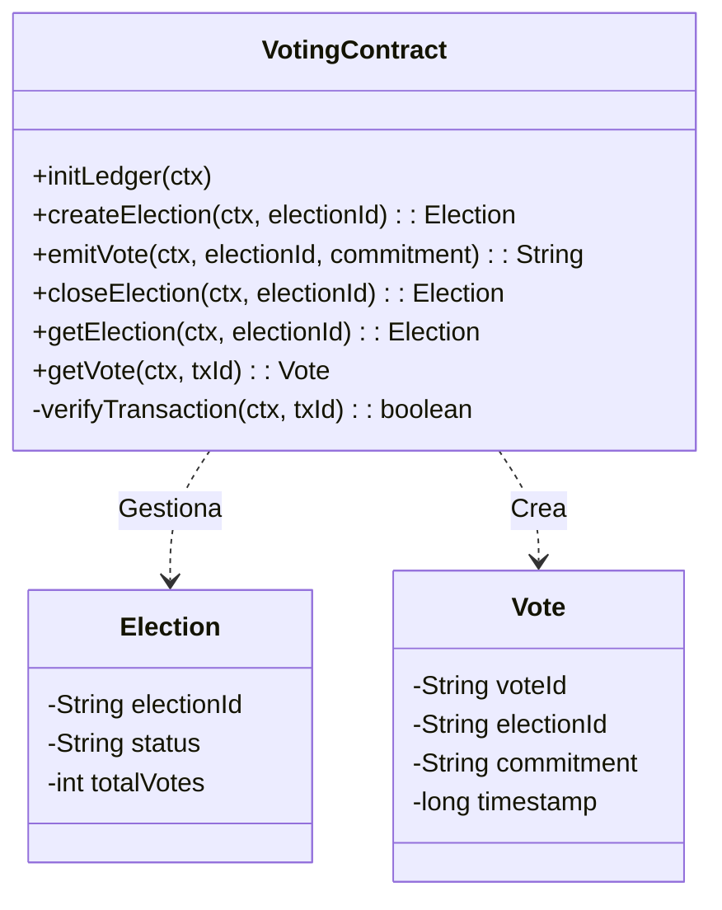

# Diseño del Chaincode (Smart Contract)

Este documento describe la lógica de negocio implementada en el Chaincode, incluyendo el modelo de datos y las políticas de seguridad.

## 1. Modelo de Datos (Ledger)

El Ledger almacena dos tipos principales de activos (`Assets`) y un registro de control para evitar el doble voto.

### Entidades

#### Election (Elección)
Representa un proceso electoral activo o cerrado.
```json
{
  "electionId": "election_2025",
  "status": "ACTIVE", // o "CLOSED"
  "totalVotes": 150
}
```

#### Vote (Voto)
Representa un voto emitido. Para garantizar el anonimato, no se almacena la identidad del votante en este objeto, solo el compromiso criptográfico (hash).
```json
{
  "voteId": "a1b2c3d4...", // Transaction ID
  "electionId": "election_2025",
  "commitment": "hash_del_candidato_elegido",
  "timestamp": 1702550000000
}
```

#### Registro de Votantes (Control Interno)
Para prevenir el doble voto sin comprometer el anonimato del voto en sí, se almacena una clave compuesta que vincula al usuario con la elección.
*   **Key**: `vote_record_{electionId}_{userId}`
*   **Value**: `{txId}`

## 2. Diagrama de Clases

El Chaincode está implementado en Java utilizando `fabric-chaincode-java`.



## 3. Lógica de Negocio y Validaciones

### Prevención de Doble Voto
Antes de registrar un voto, el contrato verifica si el usuario ya ha participado en esa elección específica.

```java
// Extracto de VotingContract.java
ClientIdentity clientIdentity = ctx.getClientIdentity();
String userId = clientIdentity.getId();
String voteRecordKey = "vote_record_" + electionId + "_" + userId;

String voteRecord = stub.getStringState(voteRecordKey);
if (voteRecord != null && !voteRecord.isEmpty()) {
    throw new ChaincodeException("User has already voted", "ALREADY_VOTED");
}
```

### Validación de Estado de Elección
Solo se permiten votos si la elección existe y está en estado `ACTIVE`.

```java
if ("CLOSED".equals(election.getStatus())) {
    throw new ChaincodeException("Election is closed", "ELECTION_CLOSED");
}
```

## 4. Políticas de Aval (Endorsement)

Para garantizar la confianza entre los sindicatos, se define una política de aval estricta a nivel de Chaincode.

*   **Política**: `AND('Org1MSP.peer', 'Org2MSP.peer')`
*   **Justificación**: Para que una transacción de voto sea válida, debe ser ejecutada y firmada por un peer de la **Org1 (Sindicato A)** Y por un peer de la **Org2 (Sindicato B)**.
*   **Seguridad**: Esto impide que una organización manipule el ledger o inyecte votos falsos sin el consentimiento de la otra parte. Si Org1 intenta enviar una transacción sin la firma de Org2, el Orderer o los peers validadores la rechazarán (Validation Code: `ENDORSEMENT_POLICY_FAILURE`).

