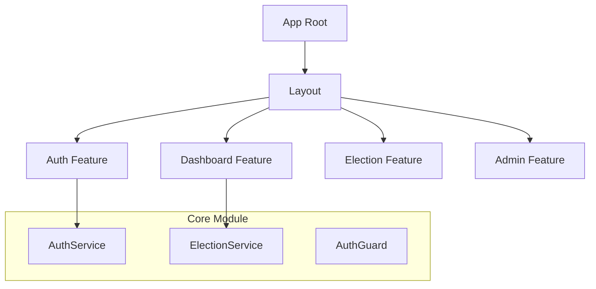

# Diseño del Frontend (Angular)

Este documento detalla la estructura de la aplicación web, la gestión de estado y la experiencia de usuario.

## 1. Arquitectura de Módulos y Componentes

La aplicación sigue una arquitectura modular basada en *Features* (funcionalidades) para facilitar la escalabilidad y el mantenimiento.



### Estructura de Directorios
*   `src/app/core/`: Servicios singleton, guardias de seguridad e interceptores HTTP.
*   `src/app/features/`: Módulos funcionales con sus componentes y rutas.
    *   `auth/`: Login y recuperación de contraseña.
    *   `dashboard/`: Vista principal del votante.
    *   `elections/`: Lista de elecciones activas y papeleta de voto.
    *   `vote-confirmation/`: Pantalla de éxito con el recibo digital.
*   `src/app/shared/`: Componentes reutilizables (botones, spinners, alertas).

## 2. Servicios e Integración API

La comunicación con el Backend se realiza a través de servicios que encapsulan `HttpClient`.

### AuthService
Gestiona la sesión del usuario.
*   **Login**: Envía credenciales, recibe JWT y lo almacena en `localStorage`.
*   **User State**: Mantiene un `BehaviorSubject<User>` para que los componentes reaccionen a cambios de estado (login/logout).

### VoteService
Encargado de la operación crítica de voto.
*   **`castVote(electionId, candidateId)`**: Envía el voto al backend. Dado que la transacción en Blockchain puede tardar unos segundos (consenso + ordenamiento), este servicio gestiona el estado de "Cargando" para la UI.

```typescript
// Ejemplo de integración
castVote(electionId: string, candidateId: string): Observable<VoteReceipt> {
  return this.http.post<VoteReceipt>(`${this.apiUrl}/vote`, { electionId, candidateId });
}
```

## 3. Seguridad en el Cliente (Guards)

Aunque la seguridad real reside en el Backend, el Frontend implementa protecciones de navegación para mejorar la UX.

### AuthGuard
Implementa `CanActivate`. Verifica si existe un token JWT válido en el almacenamiento local. Si no, redirige al usuario a `/login`.

### RoleGuard
Verifica si el usuario tiene el rol necesario (ej. `ADMIN`) para acceder a rutas sensibles como la configuración de elecciones o auditoría.

```typescript
// Ejemplo de AuthGuard
canActivate(route: ActivatedRouteSnapshot, state: RouterStateSnapshot): boolean {
  const currentUser = this.authService.currentUserValue;
  if (currentUser) {
      return true;
  }
  this.router.navigate(['/login'], { queryParams: { returnUrl: state.url } });
  return false;
}
```

## 4. Diseño de Interfaz (UX/UI)

### Feedback de Transacción
Las operaciones en Blockchain no son instantáneas (latencia de 2-3 segundos). La interfaz bloquea el botón de voto y muestra un indicador de carga (Spinner) para evitar envíos duplicados y dar feedback al usuario.

### Recibo de Voto
Al completarse la transacción, se muestra una pantalla de confirmación con el **Transaction ID (TxID)**. Este hash permite al usuario verificar posteriormente (mediante el explorador o herramienta de auditoría) que su voto fue incluido en el bloque, garantizando la verificabilidad individual.

