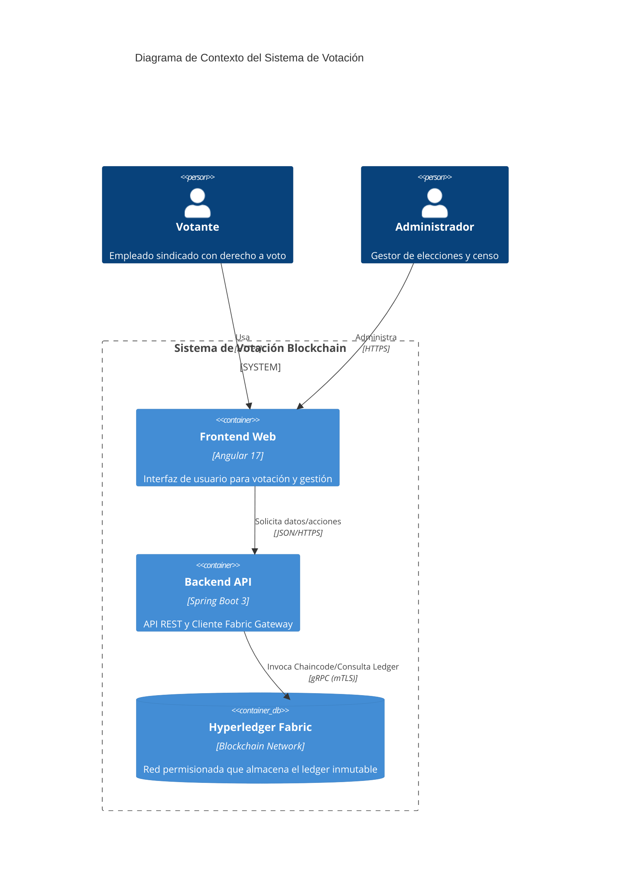
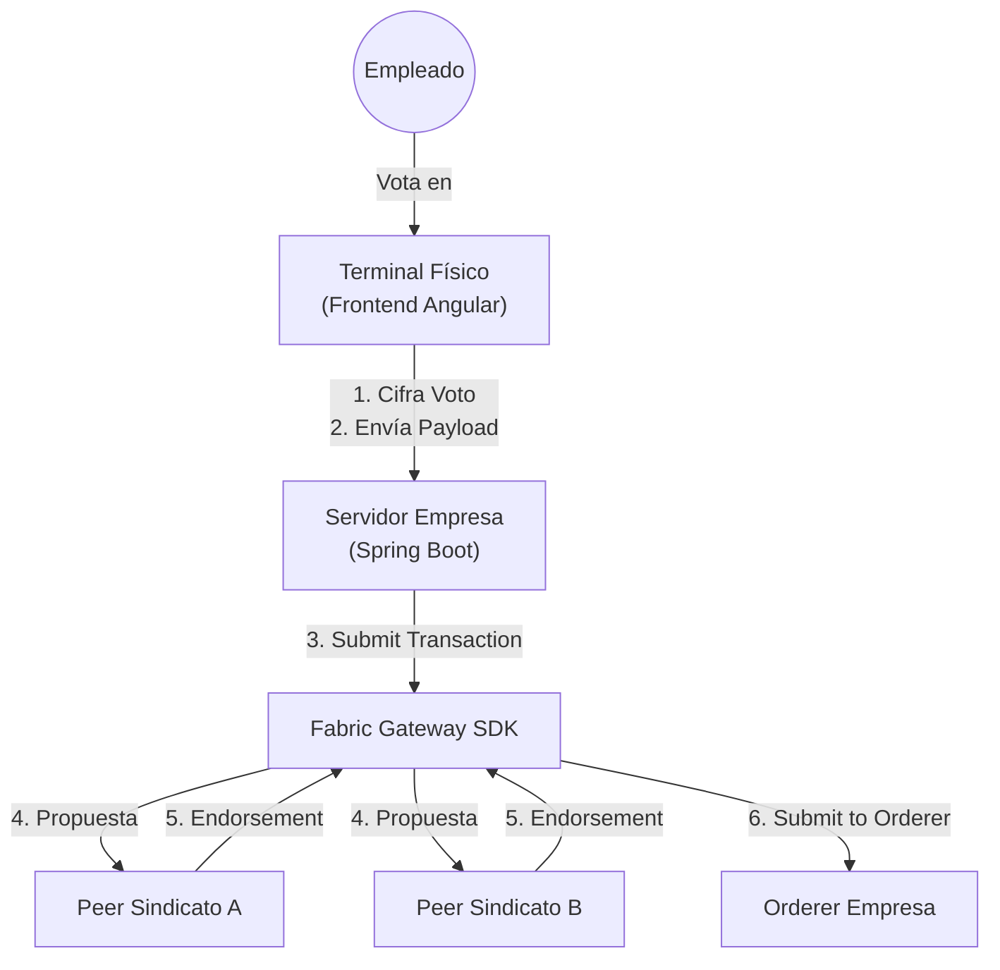
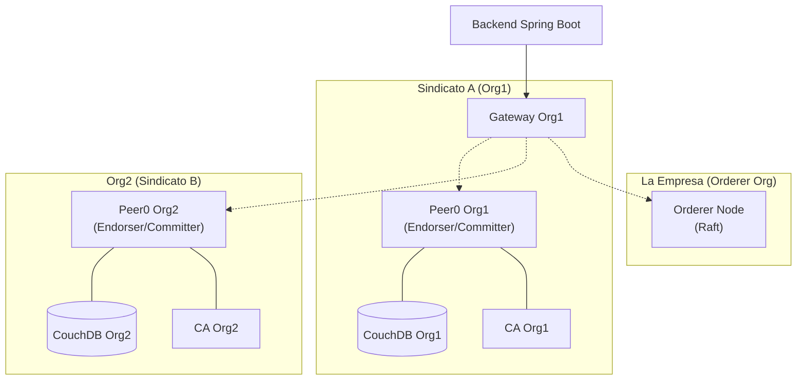
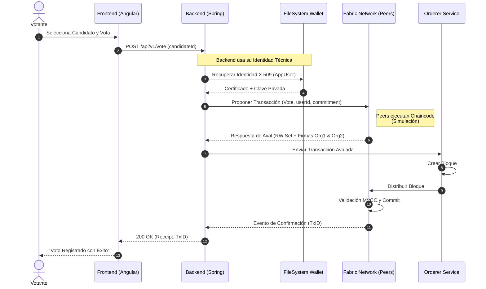

# Diseño de Arquitectura y Red Blockchain

Este documento detalla la arquitectura de alto nivel del sistema de votación, la topología de la red Hyperledger Fabric y el flujo de datos.

## 1. Visión Global (C4 Model)

El sistema sigue una arquitectura de tres capas clásica adaptada para aplicaciones descentralizadas (DApp).

### Componentes Principales
1.  **Frontend (Angular)**: SPA (Single Page Application) que gestiona la interacción del usuario. No almacena claves privadas; delega la firma de transacciones al Backend (modelo Custodial Wallet para simplificar UX).
2.  **Backend (Spring Boot)**: Actúa como cliente de la red Fabric. Gestiona la autenticación de usuarios (JWT) y utiliza una **Identidad Técnica única** (Patrón Gateway) para firmar transacciones en la red.
3.  **Hyperledger Fabric**: La red blockchain subyacente que garantiza la inmutabilidad, trazabilidad y consenso de los votos.

## 2. Topología de Hyperledger Fabric

La red se basa en la configuración estándar `test-network` pero personalizada para el caso de uso de elecciones sindicales.

### Configuración de la Red
*   **Canal**: `electionchannel`
*   **Consenso**: Raft (EtcdRaft)
*   **Base de Datos de Estado**: CouchDB (para permitir consultas ricas JSON sobre los votos).

### Nota sobre Infraestructura: Fabric vs Fabric Samples
Es importante distinguir entre **Hyperledger Fabric** (la plataforma DLT empresarial) y **fabric-samples** (repositorio de ejemplos).

*   **Hyperledger Fabric:** Es el núcleo del software (binarios de Peer, Orderer, CAs, SDKs).
*   **fabric-samples / test-network:** Es un entorno de desarrollo preconfigurado ("sandbox") proporcionado por la comunidad para facilitar pruebas locales. Utiliza scripts (`network.sh`) para levantar nodos en Docker rápidamente.

**Justificación para la PoC:**
Para este TFG, se ha utilizado la `test-network` de `fabric-samples` para agilizar el despliegue de la infraestructura y centrar el esfuerzo en la lógica de la aplicación (Chaincode y Backend).

**Trabajo Futuro (Paso a Producción):**
En un entorno real de producción, **NO** se debe usar `test-network`. Se requeriría un despliegue de Fabric personalizado (posiblemente en Kubernetes), donde:
1.  Cada organización (Empresa, Sindicatos) gestione sus propios nodos en infraestructura física/cloud separada.
2.  Las CAs sean gestionadas con políticas de seguridad estrictas (HSM).
3.  La configuración de canales y políticas se defina explícitamente (`configtx.yaml`) y no mediante scripts de ejemplo.

### Capa de Aplicación (El "Gateway" de la Empresa)

En este diseño, la **Empresa** asume el rol de proveedor de la interfaz de usuario y la conectividad, actuando como un "Gateway" hacia la red blockchain.

*   **Terminales de Voto (Frontend):**
    *   Son dispositivos físicos ("kioscos") provistos por la empresa.
    *   Ejecutan la aplicación Angular (Frontend).
    *   **Seguridad:** El cifrado del voto ocurre **en el navegador del terminal** (Client-Side Encryption) usando la Clave Pública de la Elección. El terminal nunca envía el voto en texto plano al backend.

*   **Servidor Backend (Spring Boot):**
    *   Mantenido por la empresa.
    *   Actúa como **Cliente Fabric**. Tiene una identidad (Wallet) que le permite enviar transacciones a la red.
    *   **Función:** Recibe el voto cifrado del frontend y lo reenvía a los nodos de la red (Peers de los Sindicatos) para su validación.
    *   **Confianza:** Aunque la empresa controla este servidor, **no puede leer el voto** (porque está cifrado) ni **modificarlo** (porque rompería la firma digital o el hash).
    *   **Riesgo de Censura:** La empresa podría teóricamente "tirar" un voto a la basura en lugar de enviarlo.
        *   *Mitigación:* El sistema devuelve un **Receipt (ID de Transacción)** al usuario. El usuario puede verificar independientemente (en un explorador de bloques provisto por los sindicatos) que su ID de transacción existe en el ledger.

### Organizaciones y Nodos (Mapeo de Negocio)

En este escenario, la infraestructura técnica de `test-network` se mapea a los actores reales del proceso electoral de la siguiente manera:

*   **Orderer Organization -> La Empresa:**
    *   **Rol:** Provee la infraestructura de ordenación. Empaqueta las transacciones en bloques y los distribuye.
    *   **Aclaración Técnica:** La empresa **NO opera un Peer**, solo un nodo Orderer. Por tanto, **no ejecuta Chaincode** ni valida la lógica de negocio. Tampoco emite certificados (función de las CAs).
    *   **Implicación:** La empresa facilita la red ("pone los cables") pero **no valida** el contenido de los votos ni mantiene el estado del ledger (aunque tiene una copia de los bloques crudos). El Gateway se conecta al Orderer solo en la fase final para enviar la transacción ya avalada por los sindicatos.

*   **Org1 -> Sindicato A:**
    *   **Rol:** Organización validadora.
    *   **Nodos:** `peer0.org1.example.com`.
    *   **Responsabilidad:** Mantiene una copia completa del ledger y valida que las transacciones cumplan las reglas del Smart Contract (Chaincode). Provee la identidad técnica (Gateway) que actúa en nombre de los afiliados.

*   **Org2 -> Sindicato B:**
    *   **Rol:** Organización validadora.
    *   **Nodos:** `peer0.org2.example.com`.
    *   **Responsabilidad:** Mantiene su propia copia del ledger, independiente de la del Sindicato A. Esto garantiza que ningún sindicato pueda alterar el historial sin que el otro se entere (fallo de consenso).

*   **Org1 (Sindicato A)**: Aloja el Backend y sirve como punto de entrada principal.
*   **Org2 (Sindicato B)**: Participa en el consenso y validación. Su firma es requerida para validar cualquier voto (según la política de aval).
*   **Orderer**: Ordena las transacciones en bloques y los distribuye a los peers.

## 3. Estrategia de Almacenamiento de Datos (Híbrida)

El sistema utiliza un enfoque híbrido para equilibrar la privacidad, el rendimiento y la integridad.

### A. Almacenamiento Off-Chain (Backend)
*   **Qué se guarda:** Los **BLOBs cifrados** (Binary Large Objects) que contienen la intención de voto (ej. `{"optionId": "OPCION_A"}`).
*   **Dónde:** Sistema de archivos local del Backend (`data/storage/`) o base de datos tradicional.
*   **Seguridad:** Cifrado simétrico (AES-GCM) con claves gestionadas por el Backend.
*   **Propósito:** Privacidad y almacenamiento de datos sensibles que no deben ser públicos ni inmutables permanentemente.

### B. Almacenamiento On-Chain (Blockchain)
*   **Qué se guarda:**
    1.  **Commitment:** Hash SHA-256 del BLOB cifrado. Actúa como "huella digital".
    2.  **Metadatos:** ID de transacción, Timestamp, ID de Elección.
    3.  **Registro de Participación:** Mapeo `Elección + Usuario` para evitar doble voto.
*   **Dónde:** Ledger de Hyperledger Fabric (distribuido entre todos los Peers).
*   **Propósito:**
    *   **Integridad:** Si el BLOB en el backend es alterado, su hash no coincidirá con el Commitment en la Blockchain.
    *   **No Repudio:** La Blockchain certifica que el voto existía en un momento dado y no ha sido modificado.
    *   **Unicidad:** Garantiza que cada usuario vote una sola vez.

### Flujo de Verificación (Recuento)
1.  El Backend recupera todos los BLOBs cifrados.
2.  Para cada BLOB, calcula su Hash SHA-256.
3.  Consulta a la Blockchain para obtener el Commitment asociado a ese voto.
4.  **Verificación:** Si `Hash(BLOB) == Commitment`, el voto es válido e íntegro.
5.  Si la verificación es exitosa, descifra el BLOB y cuenta el voto.

## 4. Flujo de Transacción

El siguiente diagrama de secuencia ilustra el proceso completo de emisión de un voto, desde la UI hasta la confirmación en el bloque.

### Detalles Técnicos del Flujo
1.  **Autenticación**: El usuario se autentica en el Backend. El Backend valida sus credenciales y emite un JWT.
2.  **Propuesta**: El Backend utiliza su **Identidad Técnica** (almacenada en `wallet/`) para firmar la propuesta de transacción y enviarla a `peer0.org1` y `peer0.org2`. El ID del usuario real se envía como argumento.
3.  **Aval (Endorsement)**: Ambos peers ejecutan el chaincode. Si la lógica es correcta (fecha válida, usuario no ha votado), firman el resultado y lo devuelven.
4.  **Envío**: El Backend recoge las firmas y envía la transacción al Orderer.
5.  **Commit**: Una vez el bloque es validado por los peers, el estado del mundo (World State) en CouchDB se actualiza con el nuevo voto.

