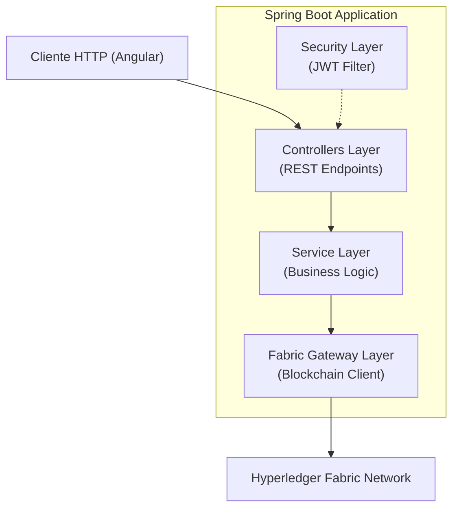
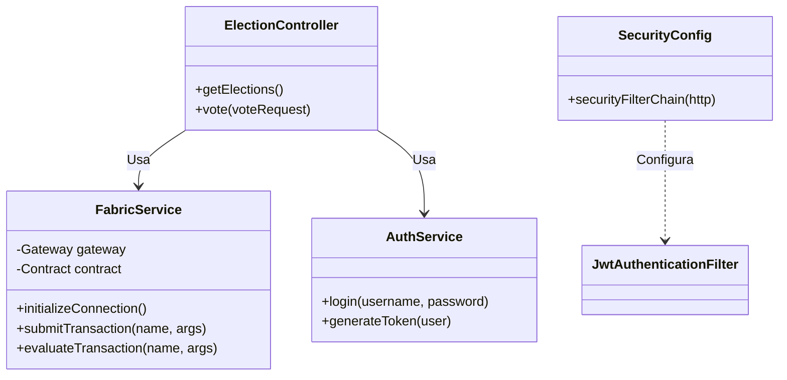

# Diseño del Backend (Spring Boot)

Este documento explica la arquitectura del servidor de aplicaciones, la gestión de identidades y la integración con el SDK de Fabric.

## 1. Arquitectura en Capas

El Backend sigue el patrón de diseño MVC (Model-View-Controller), aunque en este caso actúa como una API REST (sin vistas HTML renderizadas en servidor).



### Componentes Clave
*   **`ElectionController`**: Expone endpoints para listar elecciones y votar.
*   **`AuthController`**: Gestiona el login y la emisión de tokens JWT.
*   **`FabricService`**: Encapsula toda la complejidad de la comunicación con la blockchain.
*   **`SecurityConfig`**: Configura el filtro de seguridad para validar JWT en cada petición.

## 2. Diagrama de Clases (UML)



## 3. Seguridad y Autenticación (JWT)

El sistema utiliza **JSON Web Tokens (JWT)** para mantener la sesión del usuario de forma *stateless*.

### Flujo de Autenticación
1.  Usuario envía credenciales (`username`, `password`) a `/auth/login`.
2.  `AuthService` valida las credenciales (contra una base de datos en memoria o LDAP simulado).
3.  Si es válido, genera un JWT firmado con una clave secreta.
4.  El cliente incluye este JWT en el header `Authorization: Bearer <token>` en subsiguientes peticiones.

### Configuración de Spring Security
```java
// Extracto de SecurityConfig.java
@Bean
public SecurityFilterChain securityFilterChain(HttpSecurity http) throws Exception {
    http
        .csrf(AbstractHttpConfigurer::disable)
        .sessionManagement(session -> session.sessionCreationPolicy(SessionCreationPolicy.STATELESS))
        .authorizeHttpRequests(auth -> auth
            .requestMatchers("/auth/login").permitAll() // Público
            .requestMatchers("/api/v1/admin/**").hasRole("ADMIN") // Solo Admin
            .anyRequest().authenticated() // Resto requiere login
        )
        .addFilterBefore(jwtAuthenticationFilter, UsernamePasswordAuthenticationFilter.class);
    
    return http.build();
}
```

## 4. Integración con Hyperledger Fabric (Gateway)

La clase `FabricService` utiliza el **Fabric Gateway SDK for Java** para conectarse a la red.

### Funcionalidades Principales
*   **`emitVote`**: Envía el hash del voto a la blockchain.
*   **`getVoteCommitment`**: Recupera el hash almacenado en la blockchain para verificar la integridad de los datos locales.
*   **`closeElection`**: Cierra la elección en el ledger.

### Topología de Conexión
El `FabricService` se conecta a los Peers de los Sindicatos (Org1 y Org2) para solicitar el aval (Endorsement) de las transacciones.
*   **Peers (Org1/Org2):** Ejecutan el chaincode y firman la propuesta.
*   **Orderer (Empresa):** Recibe la transacción firmada para ordenarla en un bloque.
*   **Nota:** El Gateway no solicita certificados al Orderer ni a los Peers; utiliza una identidad X.509 pre-emitida por la CA de la Org1.

## 5. Gestión de Identidades Fabric (Patrón Gateway)

En esta implementación (PoC), se utiliza un patrón de **Identidad Técnica** o **Gateway** para simplificar la gestión de usuarios y certificados.

### Implementación Actual (PoC)
El sistema **NO** genera un certificado X.509 individual para cada usuario en el momento del login.

1.  **Identidad Única del Backend:**
    *   El Backend se conecta a Fabric utilizando una única identidad técnica pre-aprovisionada (ej. `User1@org1.example.com` o `appUser`).
    *   Esta identidad reside en el `Wallet` del servidor y tiene permisos de escritura en el Chaincode.

2.  **Autenticación de Usuario:**
    *   El usuario se autentica contra el Backend (vía JWT/Base de Datos interna).
    *   **No hay interacción con la Fabric CA** durante el login del usuario final.

3.  **Firma de Transacciones:**
    *   Cuando un usuario vota, el Backend firma la transacción con **su identidad técnica** (`User1`).
    *   La identidad real del votante (`juan.perez`) se pasa como un **argumento** explícito a la función del Chaincode (`emitVote(..., userId)`).
    *   El Chaincode confía en que el Backend ha validado correctamente al usuario (modelo de confianza delegada).

### Comparativa con Producción (Zero Trust)
En un entorno productivo de máxima seguridad, el modelo cambiaría a:

| Característica | Implementación Actual (PoC) | Producción (Ideal) |
| :--- | :--- | :--- |
| **Identidad Fabric** | Única (Backend) | Individual (Por Usuario) |
| **Generación Cert.** | Pre-generado en despliegue | `Register` & `Enroll` contra CA al login |
| **Firma Tx** | Backend firma por todos | Usuario firma con su clave privada |
| **Validación Chaincode** | Argumento `userId` | `ctx.getClientIdentity().getId()` |
| **Complejidad** | Baja (Fácil despliegue) | Alta (Gestión de Wallets y CA) |

### Conexión gRPC
La conexión se establece utilizando credenciales mTLS (Mutual TLS). El Backend actúa como un cliente autenticado de la **Org1**.

```java
// Extracto de FabricService.java
private void initGateway() throws Exception {
    // Cargar identidad X.509 (Certificado + Clave Privada)
    var identity = Identities.newX509Identity("Org1MSP", certificate);
    var signer = Signers.newPrivateKeySigner(privateKey);

    // Crear conexión gRPC con el Peer
    var builder = Gateway.newInstance()
            .identity(identity)
            .signer(signer)
            .connection(grpcChannel)
            .evaluateOptions(options -> options.withDeadline(5, TimeUnit.SECONDS))
            .endorseOptions(options -> options.withDeadline(15, TimeUnit.SECONDS))
            .submitOptions(options -> options.withDeadline(5, TimeUnit.SECONDS))
            .commitStatusOptions(options -> options.withDeadline(1, TimeUnit.MINUTES));

    this.gateway = builder.connect();
}
```

### Invocación de Transacciones
El servicio abstrae la complejidad de `submit` (escribir) vs `evaluate` (leer).

*   **`submitTransaction`**: Envía la propuesta a los peers, recoge los avales y la envía al Orderer. Espera el evento de commit.
*   **`evaluateTransaction`**: Solo consulta el estado en el peer local (no genera bloque).

