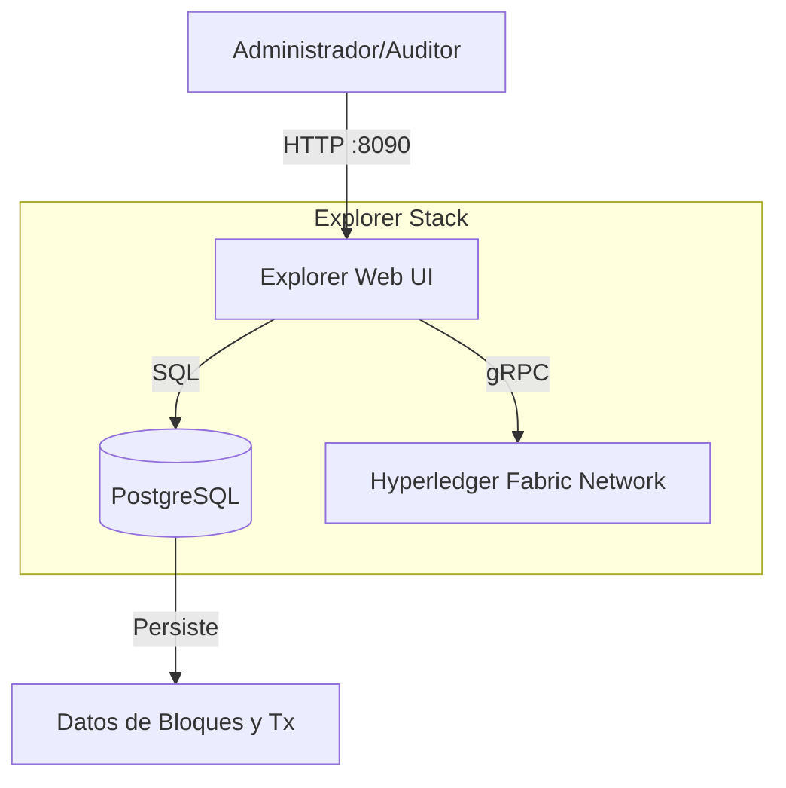

# Diseño de Monitorización (Hyperledger Explorer)

Este documento describe la herramienta de visualización y monitorización de la red blockchain.

## 1. Arquitectura del Explorador

Hyperledger Explorer es una aplicación web que permite visualizar bloques, transacciones y métricas de la red en tiempo real. Se despliega como un conjunto de contenedores Docker adicionales conectados a la red `fabric_test`.



### Componentes
*   **Explorer App**: Backend en Node.js y Frontend en React. Se conecta a la red Fabric utilizando un perfil de conexión y credenciales de administrador.
*   **PostgreSQL**: Base de datos relacional que indexa la información del ledger para permitir consultas rápidas y generación de gráficas.

## 2. Configuración e Integración

El explorador requiere acceso privilegiado a la red para leer el ledger y la configuración del canal.

### Montaje de Volúmenes
Para autenticarse, el contenedor `explorer` monta el material criptográfico generado por `test-network`.

```yaml
# docker-compose.yaml
volumes:
  - ./config.json:/opt/explorer/app/platform/fabric/config.json
  - ./connection-profile.json:/opt/explorer/app/platform/fabric/connection-profile.json
  - ../fabric-samples/test-network:/tmp/crypto # Acceso a certificados MSP
```

### Perfil de Conexión
Utiliza un `connection-profile.json` específico que define:
*   **Canal**: `electionchannel`
*   **Organización**: `Org1MSP` (Actúa como un cliente de Org1)
*   **Peers**: `peer0.org1.example.com`

## 3. Funcionalidades de Auditoría

El explorador es fundamental para la transparencia del sistema de votación.

### Dashboard Principal
Muestra métricas de alto nivel:
*   Número de bloques (Altura del Ledger).
*   Número de transacciones.
*   Nodos activos.
*   Chaincodes instanciados (`electioncc`).

### Inspección de Transacciones
Permite buscar una transacción por su **TxID** (el recibo que obtiene el votante).
*   **Detalles**: Muestra el creador de la transacción, el timestamp, y el *Read/Write Set* (qué claves cambiaron de valor).
*   **Validación**: Confirma que la transacción es válida y está en un bloque confirmado.

### Visualización de Bloques
Permite ver la cadena de bloques secuencialmente, verificando el hash del bloque anterior para asegurar la integridad de la cadena.
