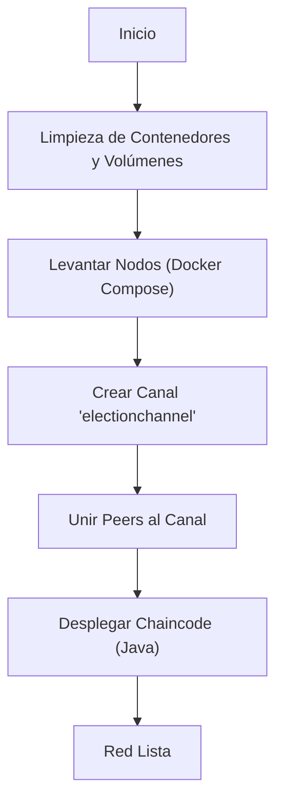

# Diseño de Scripts y DevOps

Este documento cubre los scripts de automatización para el ciclo de vida de la red, despliegue y pruebas de seguridad.

## 1. Ciclo de Vida de la Red

La gestión de la infraestructura blockchain se realiza mediante scripts de Bash que encapsulan los comandos nativos de Hyperledger Fabric (`peer`, `osnadmin`, `configtxgen`).

### `start-network.sh`
Es el script maestro de inicialización. Realiza las siguientes tareas secuenciales:



### Comandos Clave
*   **Limpieza**: `docker rm -f $(docker ps -aq ...)` asegura que no queden contenedores "zombies" que bloqueen puertos.
*   **Despliegue**: Utiliza `./network.sh deployCC` para empaquetar, instalar, aprobar y confirmar el chaincode en todos los peers de la organización.

## 1.1. Desglose Técnico: Automatización vs Manual

El script `start-network.sh` simplifica drásticamente operaciones complejas. A continuación se detalla qué ocurre "bajo el capó" y cómo se realizarían estas operaciones manualmente en un entorno de producción sin los scripts de ayuda de `fabric-samples`.

### A. Levantamiento de Nodos (Infraestructura)

*   **Vía Script:**
    ```bash
    ./network.sh up -s couchdb
    ```
    Este comando genera dinámicamente archivos `docker-compose.yaml` basados en plantillas y levanta los contenedores: 2 Peers, 1 Orderer, 2 CouchDBs y 1 CLI.

*   **Manual (Producción):**
    Se orquestaría mediante Kubernetes o Docker Swarm.
    ```bash
    # Ejemplo conceptual con Docker Compose
    docker-compose -f docker-compose-test-net.yaml -f docker-compose-couch.yaml up -d
    ```

### B. Creación del Canal (`electionchannel`)

*   **Vía Script:**
    ```bash
    ./network.sh createChannel -c electionchannel
    ```

*   **Manual (Paso a Paso):**
    1.  **Generar el Bloque Génesis del Canal:**
        ```bash
        configtxgen -profile TwoOrgsChannel -outputCreateChannelTx ./channel-artifacts/electionchannel.tx -channelID electionchannel
        ```
    2.  **Crear el Canal (Orderer):**
        ```bash
        osnadmin channel join --channelID electionchannel --config-block ./channel-artifacts/genesis_block.pb -o localhost:7053 ...
        ```
    3.  **Unir Peers al Canal:**
        ```bash
        # En cada peer (Org1 y Org2)
        peer channel join -b ./channel-artifacts/electionchannel.block
        ```

### C. Despliegue del Chaincode (Lifecycle)

El despliegue del Smart Contract es el proceso más complejo, requiriendo consenso entre las organizaciones.

*   **Vía Script:**
    ```bash
    ./network.sh deployCC -ccn electioncc -ccp ../../chaincode/java -ccl java
    ```

*   **Manual (Fabric Chaincode Lifecycle):**
    Requiere 4 pasos obligatorios:

    1.  **Empaquetado (Cualquier Org):**
        ```bash
        peer lifecycle chaincode package electioncc.tar.gz --path ../../chaincode/java --lang java --label electioncc_1.0
        ```

    2.  **Instalación (En cada Peer):**
        ```bash
        peer lifecycle chaincode install electioncc.tar.gz
        ```

    3.  **Aprobación (Por cada Org Admin):**
        Cada organización debe aprobar la definición del chaincode (versión, política de aval) para su propia organización.
        ```bash
        # Org1
        peer lifecycle chaincode approveformyorg -o localhost:7050 --channelID electionchannel --name electioncc --version 1.0 --package-id $PACKAGE_ID --sequence 1 ...
        
        # Org2 (Repetir proceso)
        peer lifecycle chaincode approveformyorg ...
        ```

    4.  **Commit (Cualquier Org una vez aprobado):**
        Una vez que suficientes organizaciones (según la política `/Channel/Application/LifecycleEndorsement`) han aprobado, se confirma la definición en el canal.
        ```bash
        peer lifecycle chaincode commit -o localhost:7050 --channelID electionchannel --name electioncc --version 1.0 --sequence 1 --peerAddresses peer0.org1... --peerAddresses peer0.org2...
        ```

## 2. Gestión de Identidades

El sistema utiliza la infraestructura de clave pública (PKI) generada por Fabric.

*   **Material Criptográfico**: Se encuentra en `fabric-samples/test-network/organizations/`.
*   **Estructura**:
    *   `peerOrganizations/org1.example.com/users/User1@org1.example.com/`: Contiene el certificado (`signcerts`) y la clave privada (`keystore`) que el Backend utiliza para firmar transacciones.

    *   `ordererOrganizations/`: Identidades para los nodos ordenadores.

## 3. Simulaciones de Seguridad

Se han desarrollado scripts específicos para validar la robustez de la red ante ataques comunes en entornos de consorcio.

### Escenario A: Ataque de Consenso (`simulate-hack.sh`)
Simula un intento de **Org1** de registrar un voto unilateralmente, puenteando a **Org2**.

*   **Mecanismo**: El script invoca el chaincode enviando la propuesta *solo* al peer de Org1 (`localhost:7051`).
*   **Resultado Esperado**: La transacción es rechazada por la red.
    *   **En Logs del Peer**: Se observa un error de validación VSCC (`implicit policy evaluation failed`).
    *   **En Explorer**: La transacción aparece marcada como **INVALID** con el código `ENDORSEMENT_POLICY_FAILURE`.
    *   Esto confirma que la política de aval `AND('Org1MSP.peer', 'Org2MSP.peer')` se aplica correctamente.

```bash
# Snippet del ataque
peer chaincode invoke \
    -o localhost:7050 \
    --peerAddresses localhost:7051 \ # Solo Org1
    # --peerAddresses localhost:9051 \ # Org2 OMITIDO INTENCIONALMENTE
    -C electionchannel -n electioncc ...
```

### Escenario B: Ataque de Identidad (`simulate-hack-company.sh`)
Simula un intento de la **Empresa (Orderer)** de influir en la votación usando sus credenciales administrativas.

*   **Mecanismo**: Se exportan las variables de entorno `CORE_PEER_LOCALMSPID="OrdererMSP"` y se intenta invocar el chaincode.
*   **Resultado Esperado**: Rechazo. Aunque el Orderer es parte de la red, su MSP no forma parte de la política de aval del chaincode (que solo incluye a los sindicatos). Por tanto, su firma no es válida para satisfacer la política `AND(Org1, Org2)`.

